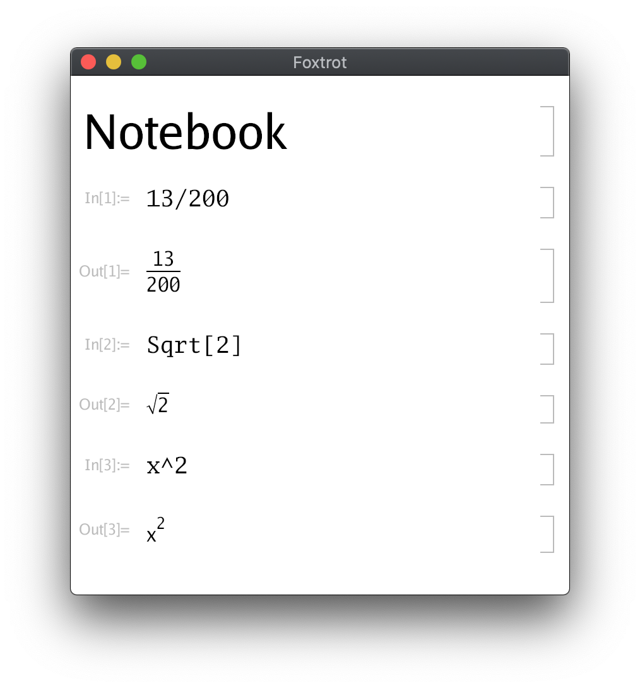

# Project Foxtrot

Foxtrot is an open-source computational algebra system.
It ships with a notebook interface where users mix natual language
and code to create beautiful interactive documents and web application.

There are builtin [API](https://corywalker.github.io/expreduce-docs/)
to solving equations, integrate functions, computer graphics, network programming and many more.    

The application is written in Go and runs on MacOSX, Linux and Windows,
and experimental support for iOS, Android and the Web.



## Installation

To install Foxtrot, first  [install Go](https://golang.org/doc/install),
then [Git](https://git-lfs.github.com/)
with the [Large File Storage](https://git-lfs.github.com/) extension.

```bash
# Clone Foxtrot repository and its submodules.
git clone --recurse-submodules https://github.com/wrnrlr/foxtrot

# Generate builtin rules that come with the expreduce submodule.
cd foxtrot/expreduce
go generate ./...

# Start Foxtrot
cd ..
go run cmd/main.go
```

## TODO

This software is very much still a work in progress.

* Copy/Paste text from cells
* Open/Save notebooks
* Basic Graphics API
* Syntax highlighting
* Package system to install third-party code
* Plugin System for graphics
* Documentation

## Acknowledgements

* [Expreduce](https://github.com/corywalker/expreduce)
* [Gio](https://gioui.org/)
* The Foxtrot Language is based on the Wolfram Language that is designed by [Wolfram Research](https://www.wolfram.com/) 